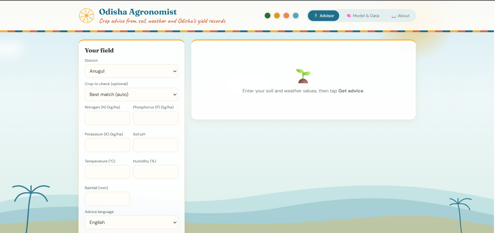
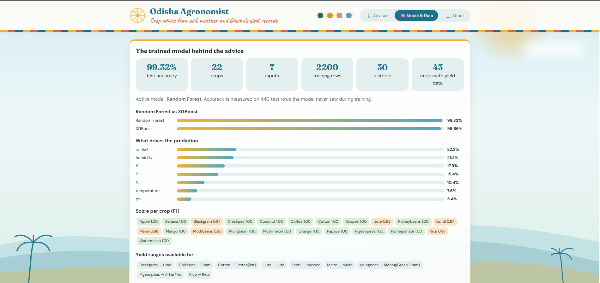
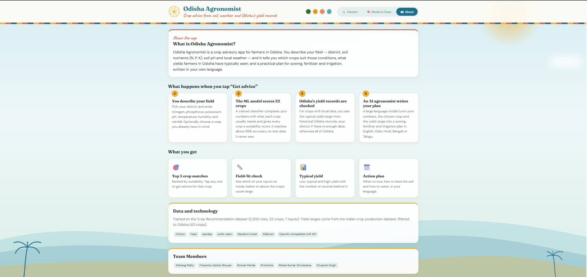

# Odisha Agronomist

A web app that helps Odisha farmers choose a crop. It takes the district, soil nutrients and weather, then gives:

1. **Optimal crop recommendation** – a Random Forest classifier scores 22 crops for the field.
2. **Yield forecast** – the typical yield range for that crop and district, taken from Odisha's historical records.
3. **AI Agronomist action plan** – a sowing schedule, fertilizer management and irrigation strategy written by an LLM, in English, Odia, Hindi, Bengali or Telugu.

**Live app:** https://odisha-agronomist-mm4j.onrender.com/

_The app runs on Render's free plan, so the first visit after a quiet period can take 30 to 60 seconds to wake up._

## Screenshots

**Advisor** – enter the district, soil and weather values to get crop matches, a yield range and the action plan.



**Model & Data** – accuracy, Random Forest vs XGBoost, what drives the prediction and score per crop.



**About** – how the app works, the data behind it and the team.



## Inputs

| Input | Details |
|---|---|
| District | Any of Odisha's 30 districts in the yield records |
| Soil nutrients | Nitrogen, phosphorus, potassium (kg/ha) and soil pH |
| Weather | Temperature (°C), humidity (%), rainfall (mm) |
| Language | English, Odia, Hindi, Bengali, Telugu |
| Crop to check (optional) | See the suitability of a specific crop |

## How it works

- **Crop classifier:** trained on the Kaggle Crop Recommendation dataset (22 crops). Random Forest scored 99.3% and XGBoost 98.9% on a held-out 20% test split; Random Forest is used. This dataset is synthetic, so treat the accuracy as a demonstration figure, not field accuracy.
- **Yield ranges:** built from the Indian crop production dataset, filtered to Odisha (29,625 rows, 30 districts, 43 crops). The app shows the 25th to 75th percentile of past yields (tonnes per hectare), not a model prediction.
- **Action plan:** the crop, soil, weather and yield range are sent to an LLM prompted to act as an Odisha agronomist. Uses the xAI Grok API through the OpenAI Python library (Groq or OpenAI keys also work).

## Data notes and limitations

- No values in the source datasets were added or changed. The yield file was only filtered to Odisha.
- About half of the yield values in the source data are recorded in a different unit (for example rice at 150+ t/ha), and all rows from 2016 onward are affected. A yield prediction model trained on this data performed worse than a plain average, so the app shows a typical range instead. Rows with implausible yields are left out **only when the range is summarised**, never from the dataset.
- The crop dataset has no district column, so the district affects the yield range and the AI advice, not the crop score.
- 13 of the 22 crops (for example apple, mango, banana) have no Odisha yield records; the app shows suitability only for them. Crops with few records (for example cotton) are flagged as low confidence.
- Advice is guidance only. Confirm doses and dates with the local Krishi Vigyan Kendra.

## Project structure

```
app.py                         Flask backend (loads both models with joblib)
templates/index.html           Web interface
models/crop_model.pkl          Random Forest crop classifier
models/yield_stats.pkl         Yield ranges per crop and district
data/processed/                Odisha yield data and crop recommendation data
odisha_crop_advisory_v5.ipynb  Notebook that builds the two .pkl files
requirements.txt
```

## Run locally

```bash
pip install -r requirements.txt
```

Create a file named `.env` next to `app.py` (it is git-ignored) with one of:

```
XAI_API_KEY=your_key
# GROQ_API_KEY or OPENAI_API_KEY also work
```

```bash
python app.py
```

Open http://127.0.0.1:5000. Without a key, crop matches and yield ranges still work; only the action plan needs it.

## Deploy on Render

- Build command: `pip install -r requirements.txt`
- Start command: `gunicorn app:app --workers 1 --timeout 300`
- Environment variable: `XAI_API_KEY` (your Grok key)

## Team Members

| Name |
|---|
| Shibang Maity |
| Priyanshu Sekhar Bhuyan |
| Roshan Panda |
| M.Tanisha |
| Rishav Kumar Shrivastava |
| Divyansh Singh |

Contributions go through GitHub.

## Data sources

- Indian crop production yield dataset (Kaggle)
- Crop Recommendation dataset (Kaggle)
